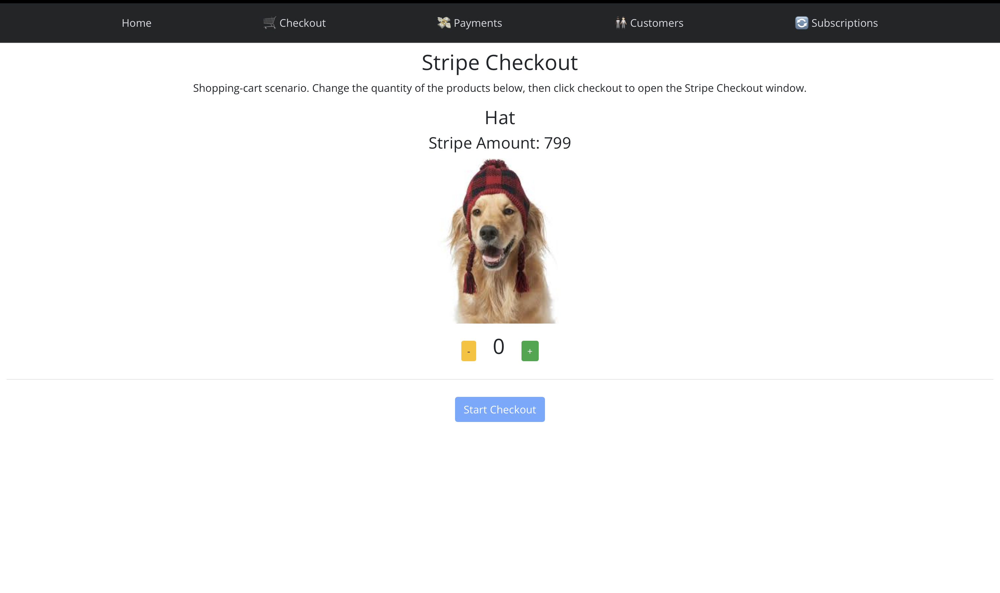
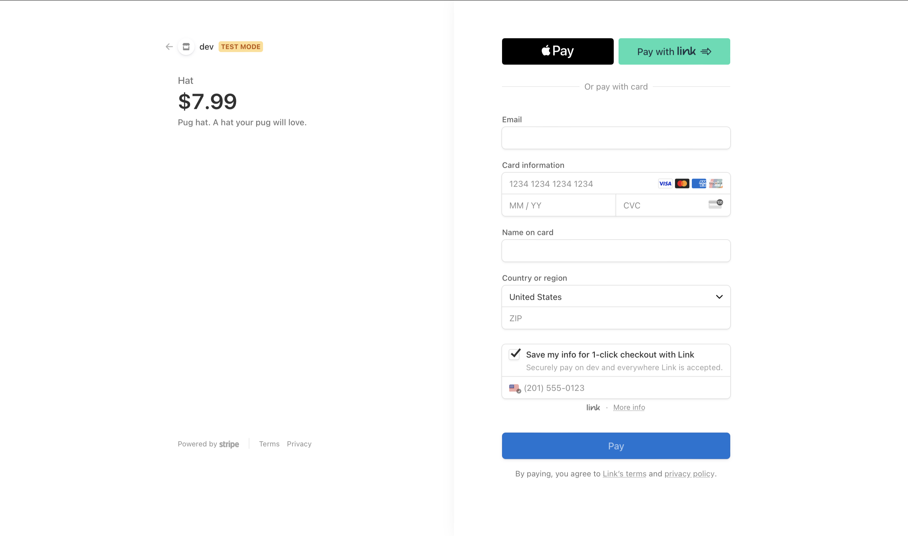

# Stripe Payments

## Description
As SaaS and Cloud products grow, it's becoming really easy to develop new technlogies without reinventing the wheel. We can spin up entire E-Commerce sites through ready-to-use components and infrastructure. I wanted to demo the Stripe API, a payment processing service that provides easy to use web app components for anything internet payment related. I first tested the Stripe Checkout product, which is a pre built, hosted payment page used for quick deployment. I also tested payment intents for when you want to have more flexibility over the payment process and its UI. I tested storing customer credit card information in Stripe through unique customer ids. I also tested the subscription feature by mapping each customer in Stripe to a unique entry in Firebase consisting of their subscription plan data. I used Express for the  

## Pictures

  
   

  Stripe Checkout. I'd buy that hat tbh.

  

  Payment Intents

  

  Stored Customer Credit Card Information

  

  Subscriptions

## Technologies
- 
- 
- 
- 
- Stripe API (https://stripe.com/docs/api)

---
*Made with <3 by Arnav, circa 2022*
